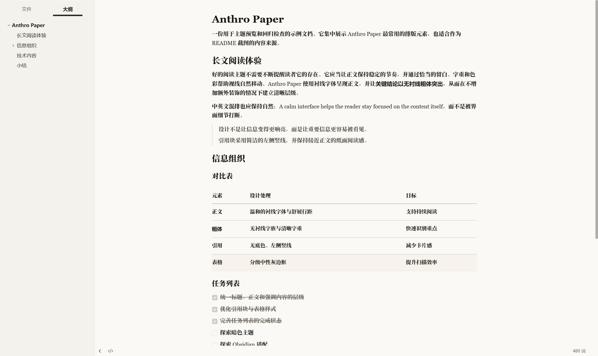
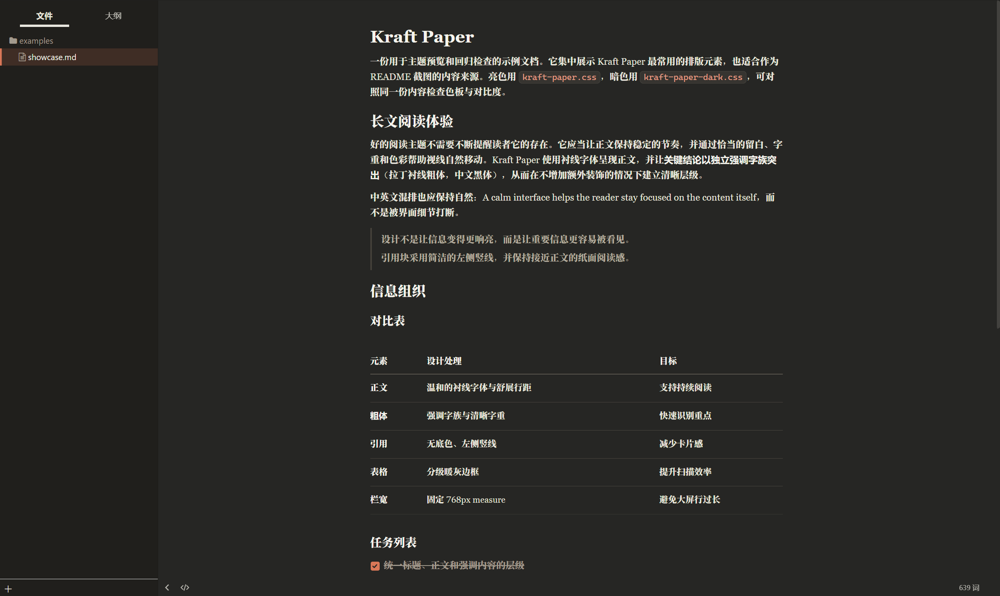

# Anthro Paper

模仿 [Claude](https://claude.ai) 界面风格的 Typora 主题：暖米色纸面、陶土橙强调、衬线正文，以及为中文排版做的一系列细调，提供亮暗双色。

> **EN** — A warm, paper-like Typora theme inspired by the Claude (claude.ai) interface: ivory canvas, terracotta accents, serif body text, and careful CJK typography. Light and dark variants included.

<!-- 截图建议：亮 / 暗各一张整页视图，另配一张中文排版特写（正文 + 加粗 + 行内代码 + 表格） -->
| Light | Dark |
| :---: | :---: |
|  |  |

## 特性

- **Claude 风格双主题** — 亮色对齐 claude.ai 的暖米色纸面（`#FAF9F5`）与陶土橙，暗色对齐其暖炭色模式（`#262624` / `#D97757`）；正文栏宽 768px，与 claude.ai 的阅读栏一致
- **中文排版细调** — 宋体正文、黑体强调，避免宋体伪粗发糊；字体栈按「拉丁在前、CJK 在后」排序，中英文各用各的字形，互不接管
- **完整 UI 覆盖** — 侧栏、Windows 标题栏与 megamenu、搜索 / 替换面板、快速打开、脚注、任务列表、`==高亮==`、目录、YAML front-matter 都做了适配
- **导出友好** — 打印 / 导出 PDF 带标题防孤悬与表格防拆页；暗色主题导出时自动切回亮色纸面，不必先换主题
- **易于自定义** — 所有颜色收敛在文件顶部的 `:root` 变量里，改一处即可全局生效

## 安装

1. 下载 [`anthro-paper.css`](anthro-paper.css) 与 [`anthro-paper-dark.css`](anthro-paper-dark.css)
2. 打开 Typora → 偏好设置（<kbd>Ctrl</kbd>+<kbd>,</kbd>）→ 外观 → **打开主题文件夹**
3. 将两个文件复制进去，重启 Typora
4. 在菜单栏 **主题** 中选择 *Anthro Paper* 或 *Anthro Paper Dark*

## 推荐字体

主题开箱即用（英文回落 Georgia，中文回落系统字体），安装以下免费字体后观感最佳：

| 字体 | 作用 | 获取 |
| --- | --- | --- |
| [Source Serif 4](https://fonts.google.com/specimen/Source+Serif+4) | 英文正文衬线；导出 HTML 时会自动联网加载 | Google Fonts，免费 |
| [思源宋体 Source Han Serif](https://github.com/adobe-fonts/source-han-serif) | 中文正文衬线；**Windows 用户强烈建议安装**，否则中文会回落到系统宋体 | Adobe，免费 |
| [IBM Plex Sans](https://fonts.google.com/specimen/IBM+Plex+Sans) | 界面英文 | Google Fonts，免费 |

代码字体默认使用系统等宽（Cascadia Code / Consolas 等），装有[更纱等宽 Sarasa Mono SC](https://github.com/be5invis/Sarasa-Gothic) 时中文注释的对齐效果更好。若本机装有 *Tiempos Text* / *Styrene*（claude.ai 同款商业字体），主题会自动优先使用。

## 自定义

颜色都定义在各文件顶部的 `:root` 中——亮色改 `anthro-paper.css`，暗色改 `anthro-paper-dark.css`：

```css
:root {
    --accent-color: #bc6a3a;   /* 例：把强调色换回更含蓄的琥珀橙 */
}
```

```css
#write {
    max-width: 720px;          /* 例：收窄正文栏宽 */
}
```

调试技巧：在偏好设置中开启「调试模式」，然后在正文区右键 → 检查元素，即可用 DevTools 实时调整样式，确认后再写回 CSS。

## 兼容性

- **Typora ≥ 1.5**。任务列表的勾选联动样式用到 `:has()`，旧版本会自动降级为 `.task-list-done` 样式
- **Windows** 已深度适配（标题栏、megamenu、页脚）；macOS 保留基础适配，遇到问题欢迎提 issue
- 两个主题文件的结构完全一致：修改排版结构时请同步两份，只改配色则各自修改 `:root` 即可

## 声明与许可

本项目为社区作品，与 Anthropic 无隶属或授权关系；Claude 名称及其界面设计归 Anthropic 所有，此处仅作风格致敬。仓库不包含也不分发任何商业字体文件。

MIT License

Anthro Paper is an independent community theme inspired only by Anthropic's reading experience. It is not affiliated with, endorsed by, or sponsored by Anthropic. Anthropic, Claude, and related names and marks belong to their respective owners.
