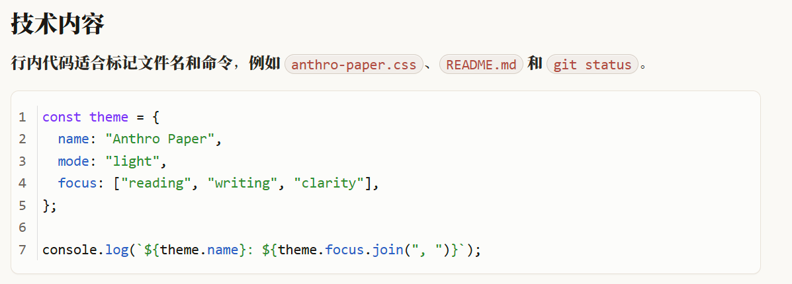

# Anthro Paper

一款温暖、克制、适合长文阅读的 Typora 浅色主题。Anthro Paper 受 Anthropic 阅读体验启发，并针对中文写作和常用 Markdown 元素进行了进一步打磨。

> [English version](#english-version)

## 安装

1. 从 [Latest Release](https://github.com/jasper0507/typora-anthro-paper/releases/latest) 下载 `anthro-paper.css`，也可以直接使用仓库中的同名文件。
2. 打开 Typora，进入 `偏好设置 → 外观 → 打开主题文件夹`。
3. 将 `anthro-paper.css` 复制到主题文件夹。
4. 重启 Typora。
5. 在主题菜单中选择 `Anthro Paper`。

## 设计目标

- 保持安静、低干扰的视觉气质，让内容成为阅读焦点。
- 为中文长文和中英文混排提供自然、稳定的排版节奏。
- 清楚区分正文、标题、强调内容和代码，同时避免过度装饰。
- 统一表格、引用块、任务列表和代码等常用 Markdown 元素的视觉语言。

当前仓库仅提供浅色版本。

## 主题特点

### 更清晰的正文强调

正文段落、列表、引用和表格中的粗体使用无衬线字体，与衬线正文形成明确对比；标题和代码中的粗体则保留各自字体，避免破坏原有层级。

### 更接近纸面排版的引用块

引用块采用无底色、左侧竖线和紧凑段落间距，减少卡片感，让引用更自然地融入长文。

### 层级明确的表格

表头、数据行和表格底部使用不同强度的中性灰分隔线，并保留舒适的单元格间距，适合参数表、对比表和技术文档。

### 完整的任务列表状态

任务列表使用定制复选框。完成项具有清晰的勾选状态和删除线，同时保留键盘焦点提示。

## 字体说明

主题字体栈优先使用 `Anthropic Serif`，但该字体是可选项，本仓库不会附带或分发任何字体文件。

如果系统中没有安装该字体，Typora 会依次使用 Georgia、Times New Roman、中文宋体及其他系统后备字体。仓库不提供非官方字体下载链接。

## 兼容性

主题主要在 Windows 11 上测试，建议配合较新版本的 Typora 使用。其他操作系统尚未做完整验证；如果遇到显示问题，欢迎提交 Issue。

## 后续计划

- 探索 Anthro Paper 暗色版本。
- 探索适配 Obsidian 的主题版本。

以上方向仍处于探索阶段，暂不承诺发布时间。

## 参与贡献

欢迎通过 Issues 或 Pull Requests 提交显示问题、跨平台兼容反馈和改进建议。项目不承诺固定的响应或采纳时间。

## 许可证

本项目采用 [MIT License](LICENSE)。许可证文件同时保留上游作者和本项目作者的版权声明。

## 致谢

Anthro Paper 基于 Muyiiiii 的 [Typora Claude-Like Theme](https://github.com/Muyiiiii/Typora_Claude-Like_Theme) 修改。感谢原作者以 MIT 许可证开放其工作。

## 非官方声明

Anthro Paper 是一个独立的社区主题，仅受 Anthropic 阅读体验启发，与 Anthropic 无关联，也未获得其授权、认可或赞助。Anthropic、Claude 及相关名称和标识归其各自权利人所有。

---

# Anthro Paper

A warm, restrained light theme for long-form writing in Typora. Anthro Paper is inspired by Anthropic's reading experience and further refined for Chinese writing and commonly used Markdown elements.

## Installation

1. Download `anthro-paper.css` from the [Latest Release](https://github.com/jasper0507/typora-anthro-paper/releases/latest), or use the file with the same name from this repository.
2. Open Typora and go to `Preferences → Appearance → Open Theme Folder`.
3. Copy `anthro-paper.css` into the theme folder.
4. Restart Typora.
5. Select `Anthro Paper` from the Theme menu.

## Design Goals

- Keep the interface calm and low-noise so the content remains the focus.
- Provide a natural, stable reading rhythm for long Chinese documents and mixed Chinese-English text.
- Distinguish body text, headings, emphasis, and code without excessive decoration.
- Give tables, blockquotes, task lists, and code a consistent visual language.

The repository currently provides a light theme only.

## Highlights

### Clearer emphasis in body content

Bold text in paragraphs, lists, blockquotes, and tables uses a sans-serif stack to create clear contrast with the serif body text. Bold text in headings and code keeps the surrounding typeface so that their hierarchy remains intact.

### Paper-like blockquotes

Blockquotes use a transparent background, a simple left rule, and compact paragraph spacing. This reduces the card-like appearance and lets quotations sit naturally within long-form writing.

### Tables with a deliberate hierarchy

Table headers, body rows, and the bottom edge use neutral dividers of different strengths, while comfortable cell spacing keeps comparison tables, parameter sheets, and technical documents easy to scan.

### Complete task-list states

Task lists use custom checkboxes. Completed items receive a clear checked state and strikethrough, while keyboard focus remains visible.

## Fonts

The theme's font stack prefers `Anthropic Serif`, but the font is optional. This repository does not include or distribute any font files.

If the font is not installed, Typora falls back to Georgia, Times New Roman, Chinese Song-style fonts, and other system fonts. No unofficial font download links are provided.

## Compatibility

The theme is primarily tested on Windows 11 and is recommended for use with a recent version of Typora. Other operating systems have not been fully verified. If you encounter a rendering issue, please open an Issue.

## Roadmap

- Explore a dark variant of Anthro Paper.
- Explore an Obsidian version of the theme.

These items are exploratory and do not have a committed release schedule.

## Contributing

Issues and Pull Requests for rendering problems, cross-platform compatibility feedback, and improvement ideas are welcome. The project does not promise a fixed response or acceptance timeline.

## License

This project is licensed under the [MIT License](LICENSE). The license file retains the copyright notices of both the upstream author and this project's author.

## Credits

Anthro Paper is based on Muyiiiii's [Typora Claude-Like Theme](https://github.com/Muyiiiii/Typora_Claude-Like_Theme). Thanks to the original author for making the work available under the MIT License.

## Disclaimer

Anthro Paper is an independent community theme inspired only by Anthropic's reading experience. It is not affiliated with, endorsed by, or sponsored by Anthropic. Anthropic, Claude, and related names and marks belong to their respective owners.
