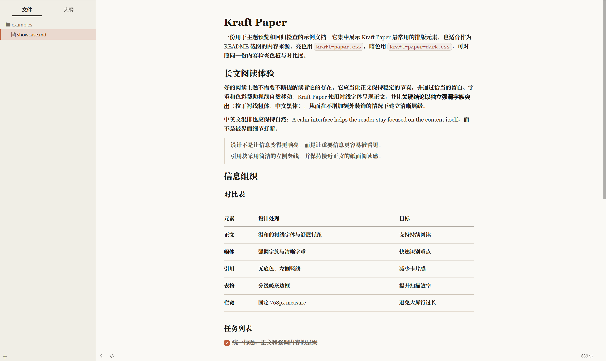

# Kraft Paper — Typora 主题（明 / 暗）

> A warm, paper-textured Typora theme (light + dark), inspired by the claude.ai design language.

### Download

| | 下载 |
| --- | --- |
| **Latest Release** | [打开发布页](https://github.com/jasper0507/kraft-paper/releases/latest) |
| **一键包**（浅色 + 暗色） | [下载 ZIP](https://github.com/jasper0507/kraft-paper/releases/latest/download/kraft-paper-v2.1.0.zip) |
| 浅色 `kraft-paper.css` | [直接下载](https://github.com/jasper0507/kraft-paper/releases/latest/download/kraft-paper.css) |
| 深色 `kraft-paper-dark.css` | [直接下载](https://github.com/jasper0507/kraft-paper/releases/latest/download/kraft-paper-dark.css) |

> 下载后复制到 Typora 主题文件夹，重启并在主题菜单中选择对应名称。详细步骤见下方 [安装](#一安装)。

---

一对以 **claude.ai 界面设计语言**为蓝本的 Typora 主题：暖米色纸感的浅色 `kraft-paper`，与暖灰深底的深色 `kraft-paper-dark`。配色对齐官网暖纸体系（陶土橙 + 暖灰中性色），排版为**正文衬线 + 界面无衬线**；中文遵循「宋体正文，黑体强调」。

**源码**在 `src/`（tokens + 共享 structure + 暗色 host adapter）；**交付**仍是两个自包含 monofile（Typora 要求）。改样式请编辑 `src/` 后执行 `npm run build`。

- 适配环境：**Typora ≥ 1.5**（建议较新版本）；主要在 **Windows 11** 上验证
- 正文栏宽固定 **768px**（约 48rem，对齐 claude.ai 聊天栏 measure），不随大屏无限加宽
- 中英混排：正文中英都走自托管 Noto Serif SC；强调分族（拉丁 Noto 700 / 中文本地雅黑）
- 内容样式限定在 `#write`，颜色 / 阴影 / 勾选图一律走 `:root` 变量

---

## 预览

**浅色 · Kraft Paper**

**深色 · Kraft Paper Dark**

> 上图为主题渲染效果预览；实际以 Typora 中体验为准。仓库另附 [`examples/showcase.md`](examples/showcase.md)，便于明暗对照回归。

---

## 一、安装

### 文件构成

| 文件 | 说明 |
| --- | --- |
| `kraft-paper.css` | 浅色主题 monofile（构建产物，可直接安装） |
| `kraft-paper-dark.css` | 深色主题 monofile（构建产物，含暗色专属规则） |
| `src/tokens/` | 明 / 暗色板（真源） |
| `src/structure.css` | 共享排版与 chrome（仅 `var(...)`） |
| `src/dark-only.css` | 暗色专用（滚动条、源码模式） |
| `kraft-paper/` | 自托管 Noto Serif SC 400/700 woff2 + `OFL.txt`（与 css 同级） |

开发者：无运行时依赖。`npm run build` 生成 monofile 并同步色板表；`npm test` 做冒烟校验。

### 主题目录

把需要的 `.css` **和** 同级 `kraft-paper/` 目录一起复制到 Typora 的主题目录。只拷 css 时 `@font-face` 会静默回退系统字族，不会白屏或报错：

| 平台 | 路径 |
| --- | --- |
| Windows | `%APPDATA%\Typora\themes\` |
| macOS | `~/Library/Application Support/abnerworks.Typora/themes/` |
| Linux | `~/.config/Typora/themes/` |

> 在 Typora → 文件 → 偏好设置 → 外观 → **打开主题文件夹**，可直接跳到该目录。

也可从 [Latest Release](https://github.com/jasper0507/kraft-paper/releases/latest) 下载，或直接使用本仓库中的同名文件。

### 启用 / 更新

- **启用**：Typora → 文件 → 偏好设置 → 外观 → 主题，选择 `Kraft Paper` 或 `Kraft Paper Dark`
- **修改 CSS 后生效**：切走主题再切回，或重启 Typora（Typora 不热载主题）
- **改样式前先备份**：编辑前复制一份 `.css`（或用 git 版本管理），便于回滚
- 明暗可同时安装，按场景切换

> **Tip**  
> 任务列表勾选态使用了 `:has()`；Typora 1.5 以下由 `.task-list-done` 规则兜底，建议仍使用 1.5+。

---

## 二、设计语言

### 色板

核心原则：陶土橙做链接、光标、勾选、焦点与侧栏激活等**强调交互**；正文 / 标题走独立暖色文本阶，边线统一暖灰，避免中性灰在米色纸面上发脏。

<!-- palette:start -->
| 角色 | 浅色 | 深色 |
| --- | --- | --- |
| 页面底色 | `#faf9f5` | `#262624` |
| 侧栏底 | `#f0eee6` | `#201F1C` |
| 正文 | `#2b2621` | `#E8E6DE` |
| 标题 | `#1c1815` | `#F5F3EC` |
| 次级文本 | `#72695e` | `#A29A8D` |
| 强调色 `--accent-color` | `#c15f3c` | `#D97757` |
| 强调悬停 | `#a14d2e` | `#E69373` |
| 强调上前景 `--on-accent-color` | `#faf9f5` | `#262624` |
| 边线 | `#ddd5ca` | `#3E3B36` |
| 高亮 `==mark==` | `#f2e3c2` | `#5C4726` |
| 行内代码字色 | `#a34a3a` | `#E39A82` |
<!-- palette:end -->

> 色板表由 `npm run build` 从 `src/tokens/` 同步；请勿手改表内 hex。

### 字体栈

| 用途 | 栈 |
| --- | --- |
| 正文 `--font-body` | Noto Serif SC → Georgia → Times New Roman → Songti SC → Source Han Serif SC → serif |
| 界面 `--font-ui` | Styrene B → IBM Plex Sans → Segoe UI → 苹方 / 微软雅黑（不挂 Noto） |
| 强调 `--font-strong` | unicode-range 强调分族：拉丁 Noto 700；CJK 本地雅黑 / 苹方 |
| 等宽 `--font-mono` | ui-monospace → Cascadia Code → Consolas → 微软雅黑 |

说明：

- 正文使用仓库内 `kraft-paper/` 的 Noto Serif SC（SIL OFL）；**不打包** Tiempos / Source Serif 4 / 文楷 / Sarasa
- 安装时必须同时复制 css 与 `kraft-paper/`。只拷 css 时静默回退 Georgia / 宋体等系统栈，不崩溃
- 界面栈把**拉丁字体放在 CJK 前面**，避免中文字体自带拉丁字形抢占英文渲染；`--font-ui` 不挂 Noto
- 导出 HTML / PDF **不请求** Google Fonts 或任何 http(s) 字体

### 版式

- 正文列宽 **768px** 居中，行高 **1.7**、段距 **0.95em**；窄窗（≤768px）收紧内边距
- 结构约定：`body` 只承载界面字体；一切内容排版规则限定在 `#write`
- 文档首个 h1 / h2 顶距收窄，避免文首大块空白
- 长 URL / 长行内代码 `overflow-wrap: break-word`，不撑破栏宽

---

## 三、内容渲染

### 标题

- h1–h6 使用正文字族 + 半粗；h1 `1.84em`，向下递减；h6 弱化为次级色，可作「眉题」
- 标题内联代码 `font-size: inherit`，不缩放破坏层级
- 标题 / 代码内的粗体**保持自身字体**，避免强调字族串入

### 强调与列表

- 正文 `**粗体**`：拉丁衬线粗体 + 中文黑体，颜色贴近标题色
- 无序 / 有序列表 marker 使用次级色；嵌套列表间距收紧
- **任务列表**：定制复选框；勾选为陶土橙；完成项删除线 + 弱化；保留 `:focus-visible` 焦点环

### 引用块

- **无底色** + 3px 左侧竖线 + 紧凑段落间距，减少卡片感，贴近纸面长文
- 嵌套引用继续缩进，不额外堆阴影

### 表格

- 表头 / 行间 / 底边使用**分级暖灰**分隔线；单元格留白偏松，适合参数表与对比表
- 行悬停淡橙底；样式**仅作用于 `#write` 内表格**，避免污染 megamenu 等界面面板
- 内容表仅样式 `.md-table-fig > table` / `#write > table`，并 `:not(.md-grid-board)`，避免九宫格与编辑浮层误吃内容表样式

### 行内代码 / 键帽 / 高亮

- `` `code` ``：小圆角暖底 + 细边框 + 红棕字；关闭编程连字（`!=` 不会变成 ≠）
- `<kbd>`：键帽样式（加厚底边）
- `==高亮==`：manilla / 暗琥珀底，替代刺眼默认黄

### 代码围栏

- 圆角卡片 + 细边框；关键字紫 / 字符串绿 / 数字橙 / 符号蓝 / 注释灰，明暗两套独立调色
- 语言标签与行号走 muted 色；围栏内不继承行内代码的边框与加粗

### 源代码模式

- 与正文同底色；等宽栈 + 关闭连字
- 深色主题额外重映射标题 / 注释 / 字符串 / 链接 / 关键字等 token，避免默认亮色语法在深底上不可读

### 其他

- **脚注**：上标走强调色；定义区名称 / 内容分层着色
- **YAML front-matter / TOC / 数学**：独立底色块，与正文纸面区分但不抢戏
- 水平线、图片 `max-width: 100%` 等常规块级元素均已纳入节奏

---

## 四、编辑器体验

- **光标**（正文）统一陶土强调色
- **选区**暖米色；`Ctrl+F` 查找命中为暖琥珀（深色为更深琥珀），替换默认刺眼亮黄
- **专注模式**：非焦点文本走 `--blur-text-color`，与主题弱化灰一致
- **侧栏**：文件树 / 列表激活项 = 淡橙底 + 陶土左边线；悬停同色系
- **快速打开 / 搜索替换 / 菜单弹窗**：面板底、边框、悬停与按钮均主题化
- **Windows**：标题栏、页脚、megamenu 做了皮肤覆盖；图标字体单独保护，避免被界面字族冲掉
- 深色主题：**滚动条**单独降对比，避免浅色拇指条在深底上刺眼

---

## 五、导出与打印

- `@media print`：正文字号收至 13px；表格 / 代码 / 引用 / 图片避免跨页截断；标题后不孤立分页
- 打印色保留（`print-color-adjust: exact`），行内代码与高亮在纸面上仍可辨
- **深色主题**在打印 / 导出 PDF 时**自动切回亮色纸面**，避免深底白字直接上纸
- 导出 HTML / PDF 不加载网络字体；编辑与导出都走自托管 Noto

---

## 六、自定义入口

| 想改什么 | 动哪里 |
| --- | --- |
| 换强调色 | `src/tokens/*`：`--accent-color` / `--accent-hover-color` / `--focus-ring-color` / `--on-accent-color` |
| 阴影 / 勾选对勾 | `--shadow-*` / `--checkbox-check-image` |
| 换字体 | `--font-body` / `--font-ui` / `--font-strong` / `--font-mono` |
| 列宽 | `src/structure.css` → `#write { max-width }`（默认 768px） |
| 代码高亮 | `--code-keyword/string/number/symbol/muted-color` |
| 表格 / 引用 | `--table-*` / `--quote-*` |
| 侧栏激活 | `--active-file-bg/border/text-color` |
| 高亮底 | `--mark-bg-color` |
| 暗色滚动条 / 源码 token | `src/dark-only.css` |

改完后：`npm run build`，再把 monofile 拷进 Typora 主题目录。终端用户若只装 monofile，仍可直接改构建产物里的 `:root`（下次 build 会覆盖）。

---

## 七、自检建议

用 [`examples/showcase.md`](examples/showcase.md) 按文内清单回归；或任意含标题 / 列表 / 任务列表 / 表格 / 代码块 / 引用 / 高亮 / 脚注的长文，在明暗两主题下对照：

1. 正文衬线与粗体强调是否分层清晰（中文粗体不发糊）
2. 表格边线层级、行悬停；编辑浮层（九宫格）**不被**内容表样式拉通栏
3. 任务列表勾选对比度（对勾走 `--on-accent-color`）、完成态删除线
4. 深色下源码模式 token 是否可读
5. 深色打印 / 导出 PDF 是否回到亮色纸面
6. Windows 下侧栏图标、megamenu 是否被字族污染
7. 开发者：`npm test`；改源码后 `npm run build`

---

## 八、致谢

本项目基于 Muyiiiii 的 [Typora Claude-Like Theme](https://github.com/Muyiiiii/Typora_Claude-Like_Theme) 修改。感谢原作者以 MIT 许可证开放其工作。

README 结构参考了 [Clay](https://github.com/chaun-yi7/Clay) 的组织方式。

---

## License

[MIT](./LICENSE)（主题 CSS 与构建脚本）。自托管 **Noto Serif SC** 为 [SIL Open Font License 1.1](./kraft-paper/OFL.txt)，与主题 MIT **分开声明**。

本主题在视觉上参考了 [claude.ai](https://claude.ai) 的公开设计语言（配色 / 版式），与 Anthropic 无隶属或背书关系。“Claude” 为 Anthropic 的商标，此处仅作事实性引用。

---

*主题文件：`kraft-paper.css`、`kraft-paper-dark.css` 与 `kraft-paper/`（一起放入 Typora 主题目录） · Typora ≥ 1.5 · 主要验证环境 Windows 11*
